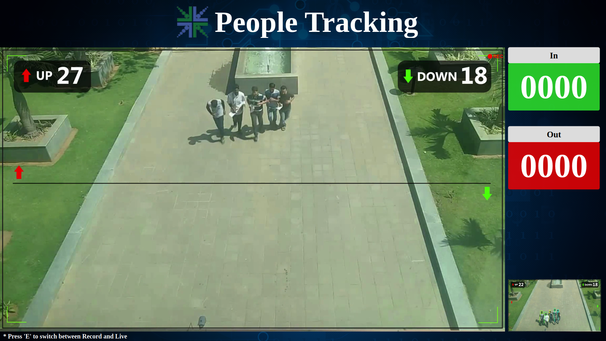

## People counting
People Counting is a demo application to calculate the in/out count of
people entering/leaving a building.

People Counting performs best with
the camera mounted in the ceiling and the camera is focused on the
floor.

### Running the application
```bash
/opt/econ/dlapp/smartecam-ai-samples/people_counting/people_counting_demo
```

### Preview


### Exiting the application
```bash
pkill -f people_counting_demo
```
